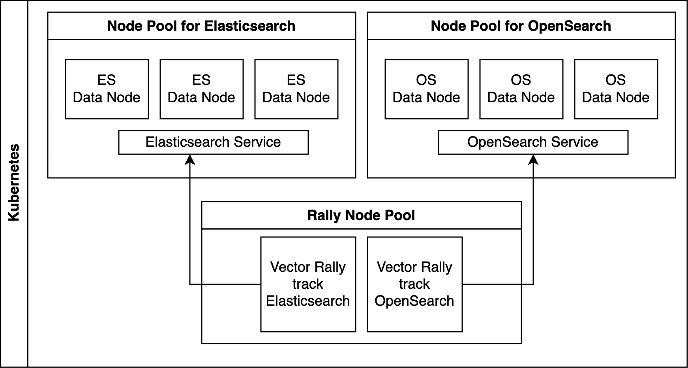

# Elasticsearch vs OpenSearch - Vector Search Performance

To ensure fair testing grounds, both search engines were tested under identical conditions in a controlled environment, which is similar as [this previously published performance comparison](https://www.elastic.co/blog/elasticsearch-opensearch-performance-gap#testing-methodology), with dedicated node pools for Elasticsearch, Opensearch, and Rally. 

## Provisioning the infrastructure




Use [this terraform script](./terraform/main.tf) to provision a Kubernetes cluster with:
- 1 Node pool for Elasticsearch with 3 `e2-standard-32` machines (128GB RAM and 32 CPUs)
- 1 Node pool for OpenSearch with 3 `e2-standard-32` machines (128GB RAM and 32 CPUs)
- 1 Node pool for Rally with 2 `e2-standard-4` machines (16GB RAM and 4 CPUs)


## Creating Elasticsearch and Opensearch clusters

### Install ECK

```bash
kubectl create -f https://download.elastic.co/downloads/eck/2.13.0/crds.yaml
kubectl apply -f https://download.elastic.co/downloads/eck/2.13.0/operator.yaml
```

Deploy the Elasticsearch Kubernetes Manifest [here](./k8s/elasticsearch-cluster.yml)

```bash
kubectl apply -f k8s/elasticsearch-cluster.yml
```


### Install OpenSearch Kubernetes Operator
```bash
helm repo add opensearch-operator https://opensearch-project.github.io/opensearch-k8s-operator/
helm install opensearch-operator opensearch-operator/opensearch-operator
```

Deploy the OpenSearch Kubernetes Manifest [here](./k8s/opensearch-cluster.yml)

```bash
kubectl apply -f k8s/opensearch-cluster.yml
```


## Running the Rally tracks

Change the `$TAG` to match your username and repository, then run `make` inside `rally-custom`

```makefile
TAG := ugosan/rally-custom:2.8.0-dev
ARM_TAG := $(TAG)-manifest-arm64v8
AMD_TAG := $(TAG)-manifest-amd64

all: build push pull

build:
	@echo "\n::: Building $(ARM_TAG)"
	docker buildx build --push -f Dockerfile --platform linux/arm64/v8 --tag $(ARM_TAG) .
	@echo "\n::: Building $(AMD_TAG)"
	docker buildx build --push -f Dockerfile --platform linux/amd64 --tag $(AMD_TAG) .
	docker manifest create $(TAG) --amend $(ARM_TAG) --amend $(AMD_TAG)
	@echo "\n::: Building done!"

push:
	docker manifest push $(TAG) --purge

pull:
	docker pull $(TAG)
```

The `rally-config.yml` contains the `rally.ini` configuration, in which you must change the [reporting] section so the results are shipped to an Elasticsearch cluster (different from the one we are using to actual run the benchmarks, obviously), elastic cloud has a 14 trial you can use.


Apply the configmap first:

```bash
kubectl apply -f k8s/rally-config.yml
````

Then the run the rally pods:

```bash
 kubectl apply -f rally-openai_vector-es.yml rally-openai_vector-os.yml
```


